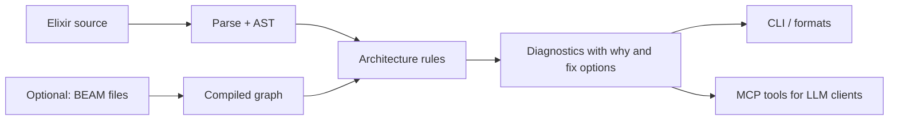
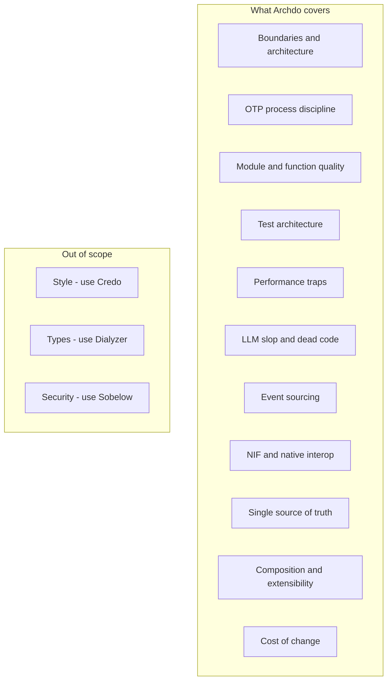
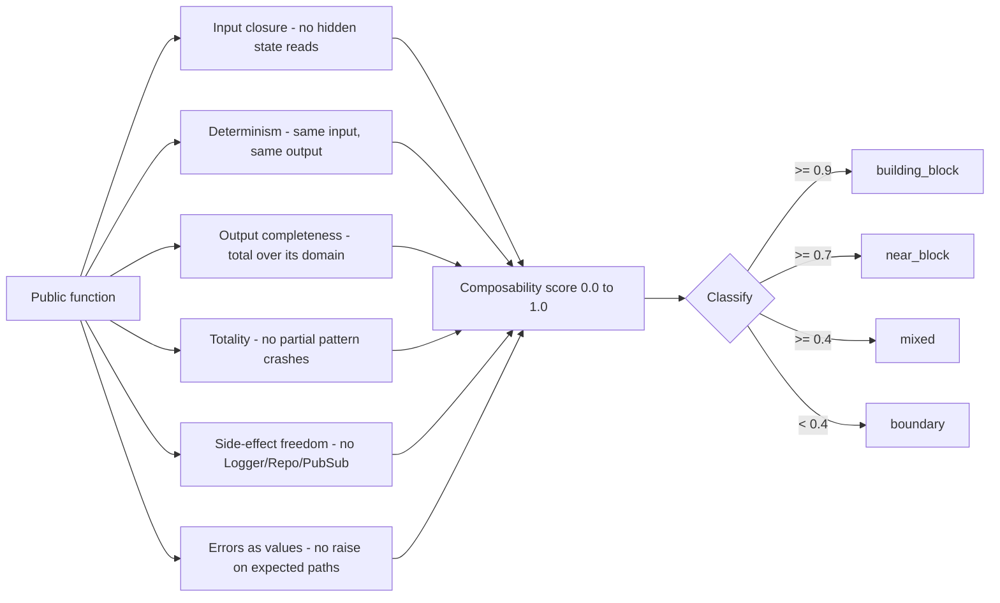
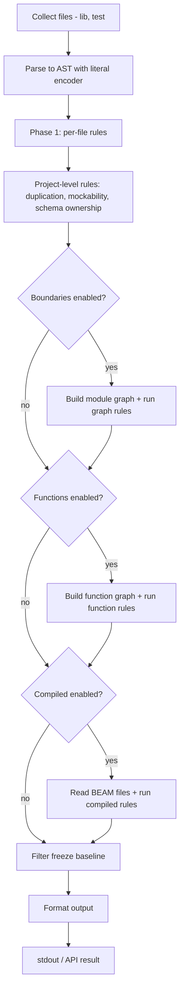

# Archdo — User Guide

> **Audience.** This guide is written for both humans and LLM agents (Claude Code, Cursor, Cline, Zed, Codex). Read this to learn what Archdo does, how to install and use it, what its outputs mean, and how to wire it into your workflow. For per-rule specifications, see [`ARCHITECTURE_RULES.md`](ARCHITECTURE_RULES.md).

---

## Table of contents

1. [What Archdo is and why](#1-what-archdo-is-and-why)
2. [Install, update, uninstall](#2-install-update-uninstall)
3. [Quick start — using the CLI to check a project](#3-quick-start--using-the-cli-to-check-a-project)
4. [What Archdo checks — broad coverage](#4-what-archdo-checks--broad-coverage)
5. [The diagnostic shape](#5-the-diagnostic-shape)
6. [Output formats](#6-output-formats)
7. [CLI reference](#7-cli-reference)
8. [Configuration (`.archdo.exs`)](#8-configuration-archdoexs)
9. [Freeze / baseline workflow](#9-freeze--baseline-workflow)
10. [MCP server (for LLM clients)](#10-mcp-server-for-llm-clients)
11. [How Archdo works internally](#11-how-archdo-works-internally)
12. [Guidance for LLM clients](#12-guidance-for-llm-clients)
13. [Troubleshooting](#13-troubleshooting)
14. [Where to read next](#14-where-to-read-next)

---

## 1. What Archdo is and why

Archdo is an **architectural quality checker for Elixir** projects. It checks the kinds of decisions that determine whether a codebase ages well — boundaries, OTP discipline, test architecture, code duplication, NIF safety — that fall outside the scope of Credo, Dialyzer, and Sobelow:

| Tool         | Checks                                  | Doesn't check                              |
|--------------|-----------------------------------------|--------------------------------------------|
| **Credo**    | Style, naming, complexity per file      | Cross-module dependencies, OTP patterns    |
| **Dialyzer** | Type contracts                          | Architecture, design                       |
| **Sobelow**  | Phoenix security (XSS, SQLi)            | Anything not security                      |
| **Archdo**   | Boundaries, OTP, test architecture, duplication, performance traps, LLM slop, event sourcing, NIF discipline, compiled analysis, Martin metrics, cost-of-change | Style, types, security |

Archdo is **deterministic** — the same code produces the same diagnostics — so it's safe to wire into CI. It's also **self-explanatory**: every diagnostic ships with an explanation of *why* the finding matters and one or more **actionable fix options**, written so an LLM can apply them without re-reading the rule documentation.



### Design principles

1. **Convention with declaration override.** Phoenix layouts work with zero config. Non-Phoenix or unusual layouts can declare layers in `.archdo.exs`.
2. **Every diagnostic is actionable.** Every finding has a `title`, a `why`, ranked `alternatives` for fixing it, and a link back to the canonical rule documentation.
3. **Tolerate grey areas.** Architectural rules have exceptions. Most info-severity rules include "verify this is real" as the first fix option, and the freeze/baseline mechanism lets you accept pre-existing violations.
4. **No magic, no inference.** If Archdo can't classify a module from convention or declaration, it reports it as `:unknown` rather than guessing.

---

## 2. Install, update, uninstall

### Install

Add Archdo to your project's `mix.exs`:

```elixir
def deps do
  [
    {:archdo, "~> 0.1.0", only: [:dev, :test], runtime: false}
  ]
end
```

Then:

```bash
mix deps.get
mix archdo --help     # confirm install
```

Archdo needs `Jason` (JSON encoding) and `JSV` (JSON Schema validation for MCP tool inputs) at runtime. It does not start an OTP application, does not modify your supervision tree, and does not depend on Phoenix or Ecto — those are detected if present.

### Update

```bash
mix deps.update archdo
```

If you pinned a specific version in `mix.exs`, bump it first; `mix deps.update` respects the version constraint.

### Uninstall

Remove the dependency line from `mix.exs` and run:

```bash
mix deps.unlock archdo
mix deps.clean archdo
```

If you have a `.archdo.exs`, `.archdo_baseline.exs`, or `.mcp.json` referencing Archdo, remove or update those as well.

### Supported environments

- Elixir 1.15+ (developed against 1.18, 1.17 supported)
- OTP 25+
- Phoenix and non-Phoenix projects
- Umbrella projects (run from each child app's root)

### Run Archdo without adding it to a project — the standalone form

You can analyse a project from a clone of Archdo itself, without modifying the target project's `mix.exs`. Useful for one-off audits, third-party code review, or trying Archdo before committing to it:

```bash
git clone https://github.com/BadBeta/archdo.git
cd archdo
mix deps.get
mix archdo --paths /absolute/path/to/some/elixir/project/lib
```

`--paths` takes an arbitrary directory or file list; the target doesn't need to know Archdo exists. Compiled-graph rules (`--compiled`) need `_build/` artefacts in the target project, so run `mix compile` over there first if you want those checks.

---

## 3. Quick start — using the CLI to check a project

Once Archdo is installed (either as a project dependency or in its standalone form), the entire tool is one Mix task. Here are the four invocations that cover most use cases.

### "Just check it" — the default

```bash
mix archdo
```

Defaults: scans `lib/`, includes boundary rules and function-graph analysis, runs the `core` pack, prints a markdown summary table grouped by rule, exits with code 0/1/2 depending on severity.

### "Check everything" — every analysis mode + every opt-in pack

```bash
mix compile
mix archdo \
  --paths lib,test \
  --tests \
  --compiled \
  --packs core,ce_compliance,ce_privacy,ce_composability \
  --format text
```

What each switch turns on:

| Switch | Effect |
|---|---|
| `--paths lib,test` | Scan both source and test trees |
| `--tests` | Enable project-level test-architecture rules |
| `--compiled` | Read BEAM artefacts for ground-truth dead-code, blast-radius, cycle, and API analysis |
| `--packs core,ce_compliance,ce_privacy,ce_composability` | Turn on every pack, not just `core` |
| `--format text` | Color-coded human-readable output with full `why` and fix options |

Run `mix compile` first; `--compiled` needs the BEAM files. Boundaries (`--boundaries`) and function-graph (`--functions`) are already on by default, so they don't need to be repeated.

### "Check my changed files" — for PR review

```bash
mix archdo --since main --format compact
```

Restricts the scan to files changed since the named git ref. `--format compact` produces one-line-per-finding output suitable for editor quickfix lists or CI logs.

### "Tell me about one specific finding"

```bash
mix archdo --explain 6.50            # what does rule 6.50 mean?
mix archdo --only 6.50 --paths lib   # show every instance of just that rule
```

### Inspect what's available

```bash
mix archdo --help               # full option list
mix archdo --list-packs         # which rules belong to each pack
mix archdo --building-blocks    # which modules/contexts pass the composability audit
mix archdo --metrics            # Martin Ca/Ce/I/A/D table
mix archdo --coverage           # test-coverage gap matrix
mix archdo --diagram overview   # Mermaid architecture diagram (requires --compiled)
```

The full CLI reference (every flag) is in §7. Output formats are covered in §6.

---

## 4. What Archdo checks — broad coverage

Archdo ships rules in two complementary layers, both backed by the same `%Diagnostic{}` shape and severity scheme:

- **Core rules** — the original architecture-quality checks. Always-on by default.
- **Change Economy (CE) rules** — a second-generation rule family focused on the *cost of changing* the system rather than its current shape, organized into opt-in packs.



### Categories and severity

| Category                      | Severity mix          | What it catches (broad strokes)                                                                  |
|-------------------------------|-----------------------|--------------------------------------------------------------------------------------------------|
| Boundaries & Architecture     | error / warning / info | Dependency direction, context encapsulation, cross-context access, anchor reachability            |
| Public API                    | warning / info        | Missing `@moduledoc` / `@spec` / `@doc` on public surface                                         |
| Single Source of Truth        | warning / info        | Code clones, scattered config, duplicated validation                                              |
| Coupling & Abstraction        | warning / info        | Behaviour size, single-impl protocols, broad imports, mockability, feature envy                   |
| OTP Process Architecture      | error / warning / info | Unsupervised processes, GenServer hygiene, supervision shape, ETS, restart strategies             |
| Module Quality                | error / warning / info | Cohesion, complexity, error handling, nesting, LLM slop, dead code, sensitive-data exposure       |
| Test Architecture             | warning / info        | Test layout, mock boundaries, async eligibility, weak assertions, untested modules                |
| Event Sourcing                | error / warning / info | Pure aggregate `apply/2`, immutable events, projector purity, command/event naming                |
| State Machine                 | warning / info        | Unreachable states, terminal-state integrity, implicit state via boolean flags                    |
| Composition                   | info                  | Deep `use` chains, excessive namespace nesting                                                    |
| Native Interop                | warning / info        | NIF behaviour boundary, dirty-scheduler config, panic patterns, Port-vs-NIF choice                |
| Change Economy                | varies                | Cost-of-change signals: volatility, contract density, cross-cutting density, traceability, privacy |

**Severity meanings** (used by every rule):

| Severity   | Meaning                                                  | CLI exit code |
|------------|----------------------------------------------------------|---------------|
| `:error`   | Almost always a bug.                                     | 2             |
| `:warning` | Almost always wrong, but may have legitimate exceptions. | 1             |
| `:info`    | Architectural smell, often a judgment call.              | 0             |

### Per-rule details

This guide does not document individual rules. The canonical rule reference is:

- [`ARCHITECTURE_RULES.md`](ARCHITECTURE_RULES.md) — every rule by category, with description, rationale, and worked examples.
- `mix archdo --explain RULE_ID` — print the rule's id, description, and category from the terminal.
- `archdo_list_rules` / `archdo_explain_rule` — the same data via the MCP server.

### Suppression markers

Some rules detect patterns that are sometimes deliberate architectural choices. For those, Archdo recognises module-level **suppression markers** — module attributes that document the deliberate choice and silence the rule for that module. The marker is a *declaration*, not a silencer: when the situation changes, remove the marker.

A representative example (full list and per-marker details are in [`ARCHITECTURE_RULES.md`](ARCHITECTURE_RULES.md)):

```elixir
defmodule MyApp.SecretsVault do
  use GenServer

  Module.register_attribute(__MODULE__, :archdo_opaque_state, persist: true)
  @archdo_opaque_state "contains operator secrets — operators run with elevated access"

  # ... GenServer callbacks ...
end
```

The `register_attribute(..., persist: true)` line goes ABOVE the `@archdo_X` assignment. `persist: true` puts the marker in BEAM metadata where Archdo's static analysis can find it without any runtime use, and prevents the Elixir 1.18+ "module attribute set but never used" warning.

### Change Economy packs

CE rules are organised into packs. The `core` pack ships on by default; the rest are opt-in via `--packs`:

| Pack | Default | Theme |
|------|---------|-------|
| `core` | on | All original rules + cost-of-change essentials |
| `ce_compliance` | opt-in | Traceability between code and external requirements |
| `ce_privacy` | opt-in | GDPR / data-protection signals (PII fields, retention, deletion paths) |
| `ce_composability` | opt-in | "Could this function become a tested building block?" |

```bash
mix archdo --paths lib --packs core,ce_privacy
mix archdo --list-packs
```

### Building-blocks evaluation

A **building block** in Archdo is a public function that scores high on six structural properties at once: it's safe to property-test, memoize, lift into a shared module, or call from concurrent code without surprises. Archdo computes a per-function 0.0–1.0 composability score and classifies modules and contexts based on whether *every* public function clears the bar.

Six axes contribute to the score (each rule that uses the score documents which axes it weights):



**How to read your project at a glance:**

```bash
mix archdo --paths lib --building-blocks
```

This prints the modules and contexts that pass the audit (every public function scores ≥ 0.9). It tells you what's safely reusable, what's a `:near_block` waiting on one extracted side effect, and what's structurally a boundary. Use it during refactors to track which parts of your codebase are gaining or losing composability.

**The `ce_composability` pack** turns the scoring into rules — they fire when a function is structurally a building block but is missing something that would unlock the payoff (a property test, a guard on inputs, an extracted side effect). Each rule has its own `why` and ranked fix options; the canonical descriptions live in [`ARCHITECTURE_RULES.md`](ARCHITECTURE_RULES.md).

**Marker:** if a module is intentionally not a building block (e.g., it carries opaque state or is a thin orchestration layer), declare that with the appropriate `@archdo_*` marker (see "Suppression markers" earlier in this section). Markers are the architectural-intent declaration; the scoring is the structural measurement.

---

## 5. The diagnostic shape

Every Archdo finding is an `%Archdo.Diagnostic{}` struct. The shape is the contract — formatters and the MCP server serialize this directly. The fields are:

```elixir
%Archdo.Diagnostic{
  rule_id: "8.2",                      # canonical id (matches ARCHITECTURE_RULES.md)
  severity: :error,                    # :error | :warning | :info
  title: "Side effect in aggregate apply/2",
  message: "Error.apply/2 calls Logger.error inside an event handler clause",
  why:
    "apply/2 is invoked on every event during aggregate rehydration, not just " <>
    "when the event is first emitted. Side effects there fire N times per " <>
    "process restart, spam observability tooling, and can re-trigger external " <>
    "systems (emails, webhooks, alerts) on every replay.",
  alternatives: [
    %Archdo.Fix{
      summary: "Move the side effect to the command handler (execute/2)",
      detail:
        "execute/2 runs exactly once per command, before any event is " <>
        "persisted. Emit the log or external call there. apply/2 should be " <>
        "a pure function from (state, event) to new state.",
      example: "```elixir\n# apply/2 stays pure ...\n```\n",
      applies_when: "The side effect should fire when the command is processed, not on replay."
    },
    %Archdo.Fix{
      summary: "Move the side effect to a process manager subscribed to the event",
      detail: "Process managers react to persisted events asynchronously...",
      example: nil,
      applies_when: "The side effect needs to coordinate with other aggregates or external systems."
    }
  ],
  references: [
    "ARCHITECTURE_RULES.md#8.2",
    "https://hexdocs.pm/commanded/Commanded.Aggregate.html"
  ],
  context: %{
    module: "Error",
    function: "apply/2",
    side_effect: "Logger.error",
    line: 87
  },
  file: "lib/errors/error_aggregate.ex",
  line: 87
}
```

### Field semantics — the contract

| Field                         | Audience       | Style                                                              | Length          |
|-------------------------------|----------------|---------------------------------------------------------------------|-----------------|
| `rule_id`                     | both           | Stable identifier matching `ARCHITECTURE_RULES.md`                  | "X.Y" string    |
| `severity`                    | both           | `:error` / `:warning` / `:info`                                     | atom            |
| `title`                       | both           | Noun phrase, no verb                                                | 3–8 words       |
| `message`                     | both           | Past-tense factual: "X calls Y", "module Z has N functions"         | 1 sentence      |
| `why`                         | LLM primarily  | Explains the architectural consequence. **No prescriptions.**       | 1–3 sentences   |
| `alternatives[].summary`      | both           | Imperative: "Move the side effect to..."                            | 1 sentence      |
| `alternatives[].detail`       | LLM primarily  | How to apply the fix; when this option fits                          | 2–5 sentences   |
| `alternatives[].example`      | LLM primarily  | Optional markdown code block (before/after)                         | ≤ 20 lines      |
| `alternatives[].applies_when` | LLM primarily  | "Use this fix when…" — disambiguates between options                | 1 sentence      |
| `references`                  | both           | Anchors like `"ARCHITECTURE_RULES.md#8.2"`, doc URLs                | list of strings |
| `context`                     | LLM primarily  | Rule-specific structured detail (module names, line numbers, counts, cycles, etc.) | map             |
| `file`                        | both           | Project-relative path                                               | string          |
| `line`                        | both           | 1-based line number, or 0 if file-level                              | integer         |

### Why the shape is structured this way

- **`title` is stable.** When you want to test "did this rule fire", assert on `title` and `rule_id`. `message` is parameterized by the source under analysis and changes between projects.
- **`message` is factual, not prescriptive.** It says what was found, not what to do. The "what to do" lives in `alternatives`.
- **`why` is detached from `message`.** The same rule fires for many different code shapes; the `why` text explains the underlying architectural principle once, the `message` describes the specific instance.
- **`alternatives` are ranked.** The first fix is the canonical answer. Subsequent fixes cover edge cases. For false-positive-prone rules, the first fix is "verify this is real" (e.g. checking that a flagged schema construction isn't in a fixture).
- **`context` is for tools.** It carries structured data the rule already computed (cycle paths, function names, counts) so a downstream consumer doesn't have to re-parse the message.

---

## 6. Output formats

`mix archdo --format <format>` accepts seven formats. All are driven by `Archdo.Formatter` and consume the same `Diagnostic` struct.

| Format     | Audience                        | Shape                                                                                |
|------------|---------------------------------|--------------------------------------------------------------------------------------|
| `summary`  | Default — overview at a glance  | Markdown pipe table grouped by rule, sorted by severity then count                    |
| `text`     | Humans at the terminal          | Color-coded, grouped by category, full `why` and `alternatives` for each finding      |
| `compact`  | grep / sed / editor quickfix     | One line per finding: `path:line: severity [rule] title — message`                    |
| `json`     | CI dashboards                    | Pretty-printed JSON with `summary` envelope; full `Diagnostic` shape preserved        |
| `llm`      | Streaming consumption by LLMs   | NDJSON, one diagnostic per line, with a pre-rendered `markdown` field on each line    |
| `sarif`    | GitHub Code Scanning            | SARIF 2.1.0; integrates with GitHub's code-scanning UI on pull requests               |
| `html`     | Stakeholder-facing reports      | Standalone dark-themed `archdo_report.html` with summary table and expandable details |

### Exit codes (all formats)

| Findings present     | Exit code |
|----------------------|-----------|
| Errors               | 2         |
| Warnings (no errors) | 1         |
| Info only / clean    | 0         |

This is so CI can use `mix archdo` directly without parsing output.

---

## 7. CLI reference

```
mix archdo [options]
```

| Option            | Type            | Description                                                                                |
|-------------------|-----------------|--------------------------------------------------------------------------------------------|
| `--paths`         | comma-separated | Paths to scan. Default: `lib`. Accepts directories or single files.                        |
| `--format`        | enum            | `summary` (default) / `text` / `compact` / `json` / `llm` / `sarif` / `html`               |
| `--only`          | comma-separated | Restrict the run to these rule ids: `--only 5.11,8.2`                                      |
| `--ignore`        | comma-separated | Skip these rule ids: `--ignore 6.1,6.4`                                                    |
| `--since`         | git ref         | Only analyze files changed since this ref: `--since main`, `--since HEAD~3`                |
| `--explain`       | rule id         | Print rule description and category: `--explain 6.50`                                      |
| `--init`          | flag            | Generate a `.archdo.exs` config file with detected project defaults                        |
| `--fix`           | flag            | Auto-apply mechanical fixes (currently: unused alias removal)                              |
| `--watch`         | flag            | Re-run analysis on file changes (2s poll). Ctrl+C to stop.                                 |
| `--boundaries`    | flag            | Cross-file boundary/graph rules. **Default: true.** Disable with `--no-boundaries`.        |
| `--tests`         | flag            | Project-level test architecture rules. Default: false.                                     |
| `--functions`     | flag            | Function-level graph analysis. **Default: true.** Disable with `--no-functions`.           |
| `--compiled`      | flag            | Read compiled beam files for ground-truth analysis (dead code, blast radius, cycles).       |
| `--packs`         | comma-separated | Rule packs to enable. Default: `core`. See §4 for the pack list.                            |
| `--diagram`       | type            | Generate Mermaid/SVG architecture diagram: `overview`, `modules`, `api`, `context:Name`, `blast:Module`. |
| `--coverage`      | flag            | Print test coverage gap matrix and exit.                                                   |
| `--metrics`       | flag            | Print Martin package metrics (Ca/Ce/I/A/D) matrix and exit.                                |
| `--building-blocks` | flag          | Print modules and contexts that pass the Blackbox audit (every public function ≥ 0.9). See §4. |
| `--list-packs`    | flag            | Print the rule-pack roster (which rules belong to each pack) and exit.                     |
| `--freeze`        | flag            | Save current findings as the baseline.                                                     |
| `--freeze-stats`  | flag            | Show baseline status (resolved, still present, new).                                       |
| `--show-all`      | flag            | Bypass the baseline filter and show every finding.                                         |

### Common invocations

```bash
# Full check — boundaries + functions enabled by default
mix archdo

# Add test architecture and compiled beam analysis
mix archdo --tests --compiled

# Fast check — skip boundary and function graph analysis
mix archdo --no-boundaries --no-functions

# PR review — only check changed files
mix archdo --since main

# Restrict to one rule
mix archdo --only 8.2 --paths lib

# Skip noise
mix archdo --ignore 6.1,6.4,7.25

# Auto-fix what's mechanical
mix archdo --fix

# Watch mode (re-runs on save)
mix archdo --watch

# Explain a rule
mix archdo --explain 6.50

# Generate config
mix archdo --init
```

### Output for different audiences

```bash
mix archdo --format text                    # Terminal review with full explanations
mix archdo --format compact                 # CI pipeline (exit code indicates severity)
mix archdo --format sarif > archdo.sarif    # GitHub Code Scanning
mix archdo --format html                    # Shareable HTML report
mix archdo --format json > diagnostics.json # Dashboard / API consumption
mix archdo --format llm > diagnostics.ndjson # LLM-friendly streaming
```

### Special-purpose commands

```bash
mix archdo --coverage --paths lib                    # Test coverage gap matrix
mix archdo --metrics --paths lib                     # Martin Ca/Ce/I/A/D table
mix archdo --diagram overview                        # Mermaid architecture diagram (requires --compiled)
mix archdo --diagram blast:MyApp.Accounts            # Blast radius for a module
```

---

## 8. Configuration (`.archdo.exs`)

Most projects work with **zero configuration** — Archdo detects Phoenix conventions from `mix.exs`. For non-Phoenix projects, umbrella apps, or custom layouts, drop a `.archdo.exs` file at the project root:

```elixir
# .archdo.exs
[
  # Layer regex patterns. Default convention assumes Phoenix:
  #   interface = MyAppWeb.*
  #   domain    = MyApp.* (excluding Repo/Mailer/Infrastructure)
  #   infrastructure = MyApp.{Repo,Mailer,Infrastructure}.*
  layers: [
    interface: ~r/^MyAppWeb\./,
    domain: ~r/^MyApp\.(?!Repo|Mailer|Infrastructure)/,
    infrastructure: ~r/^MyApp\.(Repo|Mailer|Infrastructure)/
  ],

  # Allowed dependency edges. Defaults are:
  #   interface → [domain, infrastructure]
  #   domain → [infrastructure]
  #   infrastructure → []
  allowed_deps: %{
    interface: [:domain, :infrastructure],
    domain: [:infrastructure],
    infrastructure: []
  },

  # Bounded contexts — each is a "context root module" that owns a subtree.
  contexts: [
    MyApp.Accounts,
    MyApp.Billing,
    MyApp.Catalog
  ],

  # Optional: regex matching adapter modules (excluded from some rules)
  adapters: ~r/\.(Adapters?|Impl|Client)\./,

  # Per-rule overrides (severity, ignore)
  overrides: [
    {:"5.6", :ignore},
    {:"6.1", severity: :error, max_public_functions: 15}
  ],

  # Per-rule numeric threshold overrides — replaces hard-coded
  # rule defaults without forking the rule.
  thresholds: [
    {"1.6", max_logger_calls: 5},
    {"1.11", min_files: 5}
  ]
]
```

### How layer detection actually works

`Archdo.Config` reads `mix.exs` to detect the app's name (e.g. `:my_app` → `MyApp`), then derives the default layer regexes from it. If `.archdo.exs` exists, its declarations override the defaults but `mix.exs` detection still runs to fill in the app/web module names.

**Convention with declaration override** is the principle. Convention works for the majority case; declaration handles the rest.

---

## 9. Freeze / baseline workflow

Adopting Archdo on an existing codebase typically surfaces hundreds of pre-existing issues. The freeze workflow lets you accept them as a baseline so only **new** violations show up going forward.

```bash
# 1. Capture the current state
mix archdo --freeze
# → Writes .archdo_baseline.exs with a fingerprint of every current finding.

# 2. Commit the baseline
git add .archdo_baseline.exs
git commit -m "archdo: baseline"

# 3. Day-to-day: only new findings appear
mix archdo
# → Pre-existing findings are filtered out; new violations show up.

# 4. See progress
mix archdo --freeze-stats

# 5. Bypass the baseline temporarily
mix archdo --show-all
```

The fingerprint is `{rule_id, file, line}` plus a content hash, so adding/removing unrelated lines doesn't shift the baseline.

---

## 10. MCP server (for LLM clients)

Archdo ships an **MCP (Model Context Protocol) server** so LLM clients — Claude Code, Cursor, Cline, Zed, Codex — can call Archdo's analysis directly as a tool, no human intermediary needed.

```bash
mix archdo.mcp
```

The server speaks **newline-delimited JSON-RPC 2.0** over stdin/stdout (logs go to stderr). It runs in-process — no extra OS process — and reuses the same `Archdo.Runner` the CLI uses, so results are identical.

### Tools at a glance

| Tool name              | Purpose                                                                       | Returns                                                |
|------------------------|-------------------------------------------------------------------------------|--------------------------------------------------------|
| `archdo_analyze_paths` | Run Archdo against directories or files                                       | `{summary, diagnostics: [...]}`                        |
| `archdo_analyze_file`  | Analyze an in-memory source string (no file write)                            | `{summary, diagnostics: [...]}`                        |
| `archdo_deep_review`   | Static analysis + structured review plan for deeper investigation             | `{diagnostics, review_plan: [...], instructions}`      |
| `archdo_list_rules`    | List rules (optionally filtered by category)                                  | `{count, rules: [{id, category, description, module}]}` |
| `archdo_explain_rule`  | Look up a rule by id                                                          | `{id, module, description, reference, note}`           |
| `archdo_health`        | Project health grade (A+ to D) + top rules + perf count                       | `{summary, top_rules, health_grade}`                   |
| `archdo_diff`          | Analyze only files changed since a git ref (PR review)                        | `{ref, changed_files, diagnostics}`                    |
| `archdo_diagram`       | Generate Mermaid/SVG architecture diagrams from compiled beams                | `{type, format, content}`                              |
| `archdo_perf_audit`    | Performance-only scan grouped by impact level                                 | `{total, by_impact, summary}`                          |
| `archdo_suggest`       | File-type-aware proactive suggestions (GenServer→OTP, LiveView→boundary)      | `{file_type, findings, suggestions}`                   |
| `archdo_explain_finding` | Given file:line, return finding with code context                           | `{finding, code_context}`                              |
| `archdo_fix`           | Generate executable edit suggestions for mechanical rules                     | `{fixable_count, fixes: [...]}`                        |

Per-tool input schemas are exposed via the MCP `tools/list` request and validated server-side using JSV. Use the standard MCP client to discover them.

### `archdo_deep_review` — the two-layer tool

`archdo_deep_review` combines Archdo's static analysis (Layer 1) with a structured review plan (Layer 2) that guides the LLM to investigate deeper architectural issues the AST checker cannot see.


Each review-plan item carries:

- `category` — what area to investigate (e.g. "Supervision Tree Architecture", "Resource Leak Risk").
- `priority` — 1 = most critical, 6 = informational.
- `triggered_by` — which static finding(s) triggered this investigation.
- `files_to_read` — specific files the LLM should read.
- `questions` — concrete questions to answer by reading the source code.

Use `archdo_analyze_paths` for quick structural checks; use `archdo_deep_review` for comprehensive architectural reviews where you also want to find issues that require understanding the code's intent.

### Configuring an MCP-aware client

The same `mcpServers` config works for Claude Code, Cursor, Cline, Zed, and Codex:

```jsonc
{
  "mcpServers": {
    "archdo": {
      "command": "mix",
      "args": ["archdo.mcp"]
    }
  }
}
```

**Project-local** — drop the file as `.mcp.json` in the Elixir project root. Most clients pick it up automatically when running in that directory.

**Global** — add the same entry under `~/.claude.json` (Claude Code) or the equivalent global config for your client. Add a `"cwd": "/absolute/path/to/elixir/project"` entry so the server boots in the right Mix environment.

Once the server is running, ask the LLM things like:

- *"Check the architecture of this project with archdo and walk me through the most serious findings."*
- *"List all the OTP rules archdo knows about."*
- *"Explain rule 8.2."*
- *"I'm about to write this aggregate — check it with archdo before I save it."*

### MCP tool call/response example

Request (one line of stdin):

```jsonc
{"jsonrpc":"2.0","id":2,"method":"tools/call","params":{"name":"archdo_analyze_paths","arguments":{"paths":["lib"],"only":["8.2"]}}}
```

Response (one line of stdout):

```jsonc
{
  "jsonrpc": "2.0",
  "id": 2,
  "result": {
    "content": [{"type": "text", "text": "{\"summary\":{...}, \"diagnostics\":[...]}"}],
    "structuredContent": {"summary": {}, "diagnostics": []},
    "isError": false
  }
}
```

The `structuredContent` field is the raw map; `content` is the same data serialized as a single text blob (some clients only consume `content`).

---

## 11. How Archdo works internally

Archdo is a deterministic, single-process analyzer. There's no daemon, no language server, no compiler hook — a Mix task that walks the AST, and optionally reads compiled BEAM files for ground-truth analysis.

### High-level pipeline



### Core modules

| Module                          | Role                                                                        |
|---------------------------------|-----------------------------------------------------------------------------|
| `Archdo`                        | Top-level orchestration. `run/2`, `run_and_format/2`, `freeze_baseline/2`.  |
| `Archdo.Runner`                 | Rule registry and parallel file analysis.                                   |
| `Archdo.Rule`                   | The behaviour every rule implements (`id/0`, `description/0`, `analyze/3`). |
| `Archdo.Diagnostic`             | The finding struct + `error/2`, `warning/2`, `info/2` builders.             |
| `Archdo.Fix`                    | One actionable fix option (used inside `Diagnostic.alternatives`).          |
| `Archdo.AST`                    | Parsing helpers + AST traversal.                                            |
| `Archdo.Graph`                  | Module-level dependency graph (built from aliases/imports/calls).           |
| `Archdo.FunctionGraph`          | Function-level call graph (for fan-in/fan-out, feature envy, sync chains). |
| `Archdo.Metrics`                | Martin package metrics (Ca/Ce/I/A/D).                                       |
| `Archdo.Config`                 | `.archdo.exs` loading, layer/context classification.                        |
| `Archdo.Freeze`                 | Baseline fingerprinting + filter.                                           |
| `Archdo.Compiled`               | I/O boundary for BEAM analysis.                                             |
| `Archdo.Compiled.Graph`         | Complete interaction graph from BEAM files: modules, calls, indexes, queries. |
| `Archdo.Compiled.Diagram*`      | Mermaid/SVG diagram generators (overview, OTP, system, blast, delta).       |
| `Archdo.Formatter`              | Seven output formats.                                                       |
| `Archdo.Mcp.Server`             | JSON-RPC 2.0 stdio MCP server with JSV input validation.                    |
| `Archdo.Mcp.Tools.*`            | The MCP tool implementations.                                               |
| `Mix.Tasks.Archdo`              | The `mix archdo` CLI.                                                       |
| `Mix.Tasks.Archdo.Mcp`          | The `mix archdo.mcp` entry point.                                           |

### Rule anatomy

Every rule is a tiny module that implements `Archdo.Rule`:

```elixir
defmodule Archdo.Rules.SomeCategory.SomeRule do
  @moduledoc false
  @behaviour Archdo.Rule

  alias Archdo.{AST, Diagnostic, Fix}

  @impl true
  def id, do: "X.Y"

  @impl true
  def description, do: "Short summary used by archdo_list_rules"

  @impl true
  def analyze(file, ast, _opts) do
    case relevant?(ast) do
      false -> []
      true ->
        ast
        |> find_offenses()
        |> Enum.map(&build_diagnostic(file, &1))
    end
  end

  defp build_diagnostic(file, offense) do
    Diagnostic.warning("X.Y",
      title: "...",
      message: "...",
      why: "...",
      alternatives: [
        Fix.new(summary: "...", detail: "...", applies_when: "..."),
        Fix.new(summary: "...", detail: "...", applies_when: "...")
      ],
      references: ["ARCHITECTURE_RULES.md#X.Y"],
      context: %{},
      file: file,
      line: offense.line
    )
  end
end
```

Graph rules implement `analyze_graph/2` instead and take a pre-built `%Archdo.Graph{}`.

### How parsing works

`Archdo.AST.parse_file/1` uses `Code.string_to_quoted/2` with `literal_encoder: &{:ok, {:__block__, &2, [&1]}}` so literals are wrapped in `:__block__` nodes. This preserves line metadata for literals (otherwise atoms/numbers lose their line numbers), which the rules need for accurate diagnostics.

---

## 12. Guidance for LLM clients

If you are an LLM agent and you have access to the Archdo MCP server, here is how to use it well.

### When to call Archdo

**Always call it when:**

- The user asks you to "check the architecture", "review the OTP setup", "audit boundaries", or anything similar — **use `archdo_deep_review`** for this, not `archdo_analyze_paths`.
- The user asks why a specific module/file feels wrong.
- You're about to commit a non-trivial change to an Elixir project — run `archdo_analyze_paths` on the touched files and surface any new diagnostics.
- A test failure looks like it might be caused by an architectural smell (sync deadlocks, blocking init, etc.).

**Consider calling it when:**

- The user asks you to refactor an Elixir module — fetch the existing diagnostics first so the refactor addresses real issues, not invented ones.
- You're writing new code in an event-sourced project — run `archdo_analyze_file` on what you're about to write.
- The user mentions a rule id ("can you fix the 5.11 finding?") — call `archdo_explain_rule` to make sure you understand the rule before acting.

**Which tool to pick:**

| User intent | Tool |
|---|---|
| "Check this file quickly" | `archdo_analyze_paths` or `archdo_analyze_file` |
| "Do a full architectural review" | `archdo_deep_review` — then **read the files in the review plan** |
| "How's this project doing?" | `archdo_health` |
| "Check my PR / changed files" | `archdo_diff` with ref `main` |
| "Show me the architecture" | `archdo_diagram` with type `overview` |
| "Any performance issues?" | `archdo_perf_audit` |
| "I'm editing this file, what should I watch for?" | `archdo_suggest` |
| "What's wrong at this line?" | `archdo_explain_finding` |
| "Fix these findings for me" | `archdo_fix` |
| "What rules exist?" | `archdo_list_rules` |
| "Explain rule X" | `archdo_explain_rule` |

### How to consume a diagnostic

Each `Diagnostic` has the following intent:

1. **`title` + `severity` + `file:line`** — what the finding is and where it lives.
2. **`message`** — the specific instance: which symbol, which call, which count.
3. **`why`** — the underlying architectural reason. Read this so your suggestions are grounded.
4. **`alternatives`** — pre-ranked fix options. **Do not invent your own first.** Use the existing alternatives.
5. **`alternatives[].applies_when`** — read this to pick which alternative fits the user's situation.
6. **`alternatives[].example`** — if present, this is a known-good before/after. Adapt it to the user's code rather than rewriting from scratch.
7. **`references`** — usually `ARCHITECTURE_RULES.md#X.Y`. Open that anchor in the project for canonical context if the `why` doesn't give you enough.
8. **`context`** — structured data the rule already extracted. Use it instead of re-parsing the message.

### The fix-application loop

When the user says "fix this finding":

1. Pick the alternative whose `applies_when` matches the user's situation. If you can't tell, ask.
2. Read the file at `diagnostic.file` to get the surrounding code.
3. Apply the fix in-place, mirroring the structure of the `example` if one is provided.
4. If the rule is one of the false-positive-prone ones, the first alternative is usually "verify this is real" — actually verify before changing code.
5. After applying the fix, re-run `archdo_analyze_file` (or `archdo_analyze_paths` for the touched file) to confirm the diagnostic is gone.
6. If new diagnostics appeared, surface them — don't paper over them.

### Severity → action policy

| Severity   | Default action                                                                       |
|------------|--------------------------------------------------------------------------------------|
| `:error`   | Treat as a blocker. Fix it now or call out that it needs human attention immediately. |
| `:warning` | Default to fixing. If a user says "ignore this", explain the trade-off briefly.       |
| `:info`    | Surface but don't auto-fix. These are judgment calls. Walk the user through the alternatives. |

### Things not to do

- **Don't invent rule ids.** Only use ids returned by `archdo_list_rules` or appearing in diagnostics.
- **Don't paraphrase the `why`** when explaining a finding to the user — it's been carefully written. Quote it directly or close to it.
- **Don't suggest fixes that aren't in `alternatives`** unless the user explicitly asks for a different approach. The alternatives are the canonical answers.
- **Don't ignore the freeze baseline.** If the user has `.archdo_baseline.exs`, respect it: pre-existing findings are intentional acceptances, not things to fix.
- **Don't disable `--boundaries` or `--functions`** unless the project is very large and the user is waiting. Both are now enabled by default because they catch the most important architectural issues.

---

## 13. Troubleshooting

### "I see `key :suggestion not found` errors"

You're on a stale build from before the diagnostic shape was reworked. Run `mix deps.compile archdo --force` and `mix compile --force`.

### "Boundary rules don't fire"

Cross-file boundary rules only run with `--boundaries`. Without that flag, they're skipped. Also make sure `.archdo.exs` declares the layers/contexts you expect, or that the project follows Phoenix conventions.

### "The function-level rules report nothing"

They need `--functions` to build the function call graph. Without it, those rules don't have their input data and emit nothing. Function graph analysis is the slowest mode — expect a few seconds on a large codebase.

### "MCP server starts but my LLM client doesn't see the tools"

Three things to check:

1. Run `mix archdo.mcp` manually from a terminal in the project directory. It should print `archdo MCP server starting (...)` to stderr and wait. If it crashes, the issue is your Mix env.
2. Confirm `.mcp.json` (or your client's equivalent) is in the directory the client launches from. Most clients only re-scan on startup — restart the client.
3. Tail your client's MCP log if it has one. The server logs all errors to stderr with the prefix `[archdo.mcp]`.

### "I get diagnostics on test files I don't expect"

Most rules skip test files via `Archdo.AST.test_file?/1`, which matches paths containing `/test/` or ending in `_test.exs`. If your test layout doesn't match those patterns, the rules will treat tests as production code.

### "The same finding appears multiple times"

Rules with file-level diagnostics (line 0 or 1) can appear once per offense rather than once per file. If that's noise, use `--ignore <rule_id>` to skip the rule, or freeze it.

### "Atom table grows when running on huge projects"

Archdo parses every file with `Code.string_to_quoted/2`, which can intern atoms. Most rules now use string-based comparisons internally, but if you hit the atom limit, run `mix archdo --paths lib` instead of `mix archdo --paths .` so you scan less.

---

## 14. Where to read next

- [`ARCHITECTURE_RULES.md`](ARCHITECTURE_RULES.md) — every rule by category, with description, rationale, suppression markers, and worked examples. The canonical rule reference.
- [`README.md`](README.md) — short orientation and quick-start.

---

*This guide is canonical for what Archdo is, how to use it, and how to interpret its output. For per-rule specifications, consult `ARCHITECTURE_RULES.md`.*
